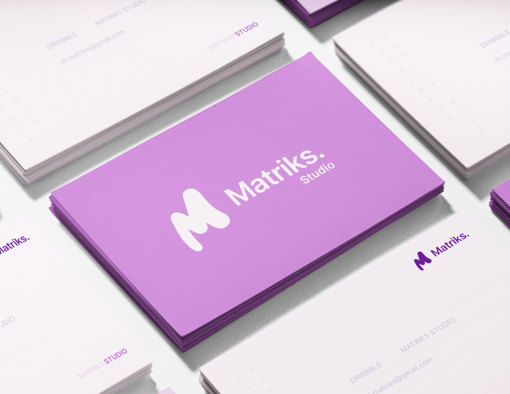

# Matriks Studio

  

## About
Matriks Studio is a design studio with over 2+ years of experience in the industry. Our team of experts has worked with more than 5 satisfied clients, providing high-quality and innovative solutions for their design needs.

## Our Service
✅ Digital Product Design 
✅ Web Development (React, Go Language) 
✅ Motion Design 
✅ Micro Interaction 
✅ Prototyping 
✅ Wireframing 
✅ No-Code Development (Framer, Webflow)

## Connect Us

## Tech Stack

